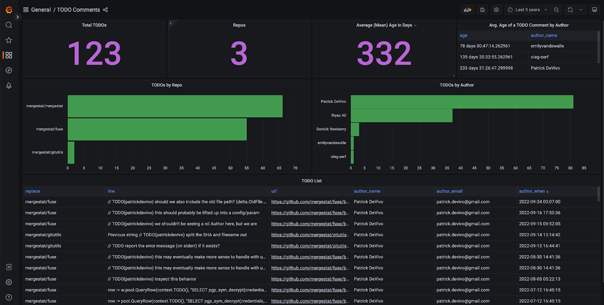

# How Elude Uses MergeStat to Keep Track of TODO Comments

If you’ve spent any time around code, you’ll know that `// TODO` comments are a fact of life.
They're a common pattern, regardless of how you feel about them!
For instance, the Kubernetes codebase has [over 2,000](https://augmentable.medium.com/looking-at-kubernetes-2k-todo-comments-b2db42dc7fdb), and Linux has [over 3,000](https://news.ycombinator.com/item?id=21910391).

In the [MergeStat](https://github.com/mergestat/mergestat) codebase, we use them as a low-effort way to track small, technical debt items.
Sometimes, a future fix or refactor might not warrant a ticket (it’s too small and too specific to a piece of implementation detail), but it’s still worth making a note.
TODO comments are a good fit for this because they are:

- **Low effort** - very easy to add and remove, just leave a comment in the code
- **Safe from context switching** - no need to switch into a ticketing system, stay in the editor and near the relevant code
- **Tracked in version control** - so you have a history and audit trail

We recently connected with [Ivan Smirnov](https://allmylinks.com/ismirnov), CTO of [Elude](https://elude.co/) on this topic, and were excited to learn about his enthusiasm for tracking TODO comments 🙂.
He shared that during his time at Google, there was an internal system which aggregated TODOs across codebases, as a way of surfacing parts of code worth returning to.
He missed having a similar solution in his role at Elude.

Luckily, we were able to help with a [MergeStat](https://www.mergestat.com/) + [Grafana](https://grafana.com/) based solution!
Elude operates a self-hosted instance of MergeStat (using our [Kubernetes helm chart](https://github.com/mergestat/helm-charts/tree/main/charts/mergestat)), and connects to its PostgreSQL database with a Grafana instance.
We collaborated on putting together a starting “TODO Tracker” dashboard, which is available in [our examples](https://github.com/mergestat/mergestat/tree/main/examples) as a [Grafana export](https://github.com/mergestat/mergestat/tree/main/examples/github/code-todos):



> "Elude currently uses TODO comments as a low friction mechanism to track technical debt. MergeStat is the missing link that allows us to turn these comments into trackable, actionable tasks." – Ivan Smirnov, Elude CTO 

The SQL involved looks something like this:

```sql

SELECT
    git_blame.line,
    git_blame.author_name,
    git_blame.author_email,
    git_blame.author_when,
    REPLACE(repos.repo, 'https://github.com/', '') AS repo,
    repos.repo || '/blob/main/' || git_blame.path || '#L' || git_blame.line_no AS url -- generate a link to the line in GitHub
FROM git_blame
INNER JOIN repos ON repos.id = git_blame.repo_id
WHERE git_blame.line LIKE '%TODO%'
ORDER BY git_blame.author_when ASC
```

and should be fairly easy to customize to different needs:

- Only apply to certain repos
- Filter out certain file paths by pattern
- Look for `FIXME` and `BUG` comments as well
- Parse out "assignees" (i.e. `TODO(patrickdevivo)`)
- etc...

If you're interested in taking a look at your own `// TODO` comments, go ahead and try out a [local instance of MergeStat](https://docs.mergestat.com/mergestat/getting-started/running-locally/)!

:::info Join our Slack

Our [**community Slack**](https://join.slack.com/t/mergestatcommunity/shared_invite/zt-xvvtvcz9-w3JJVIdhLgEWrVrKKNXOYg) is a great place to find help and ask questions. We're always happy to chat about **MergeStat** there 🎉!

:::
