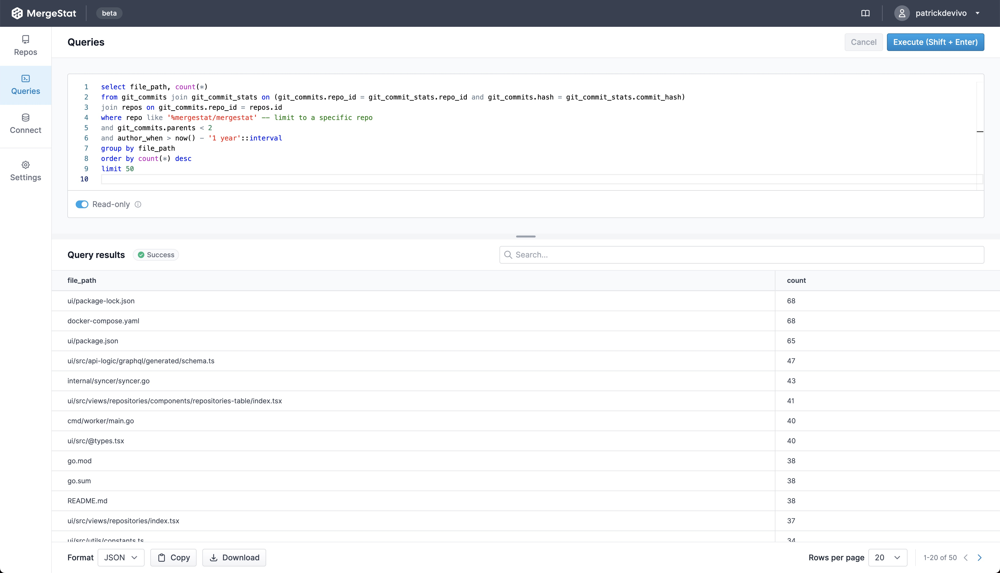
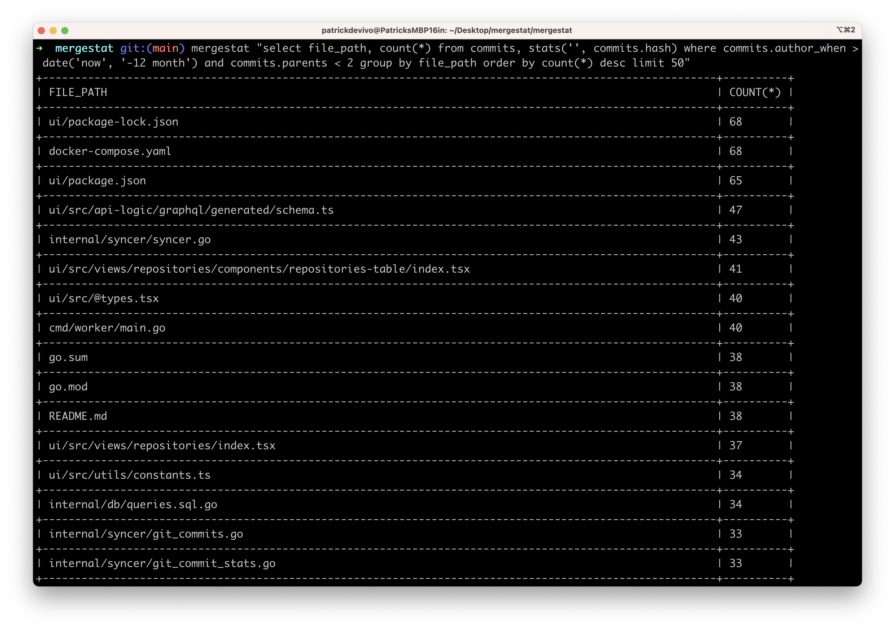

# Finding Code Hotspots in Git Repositories 🔥

Recently, I came across [this tweet](https://twitter.com/nicoespeon/status/1605586911900438528) from [Nicolas Carlo](https://understandlegacycode.com/):


[](https://twitter.com/nicoespeon/status/1605586911900438528)

Finding hotspots in a (git) codebase can be surfaced with the following:

```sh
git log --format=format: --name-only --since=12.month \
 | egrep -v '^$' \
 | sort \
 | uniq -c \
 | sort -nr \
 | head -50
```

This [defines](https://understandlegacycode.com/blog/focus-refactoring-with-hotspots-analysis/#calculate-the-churn-score-of-each-file) hotspots as the files most frequently modified in the last year (by number of commits).

This bash script looks a lot like what both [MergeStat](https://github.com/mergestat/mergestat) and [MergeStat Lite](https://github.com/mergestat/mergestat-lite) can surface, but using SQL 🎉!

## MergeStat Example

[MergeStat](https://github.com/mergestat/mergestat) can be used to surface this list as well:

```sql
select file_path, count(*)
from git_commits join git_commit_stats on (git_commits.repo_id = git_commit_stats.repo_id and git_commits.hash = git_commit_stats.commit_hash)
join repos on git_commits.repo_id = repos.id
where repo like '%mergestat/mergestat' -- limit to a specific repo
and git_commits.parents < 2 -- ignore merge commits
and author_when > now() - '1 year'::interval
group by file_path
order by count(*) desc
limit 50
```

[](https://github.com/mergestat/mergestat)

## MergeStat Lite Example

[MergeStat Lite](https://github.com/mergestat/mergestat-lite) (our CLI) can be run against a git repo on disk to surface the same set of file paths:

```sql
select
    file_path, count(*)
from commits, stats('', commits.hash)
where commits.author_when > date('now', '-12 month')
and commits.parents < 2 -- ignore merge commits
group by file_path
order by count(*) desc
limit 50
```

[](https://github.com/mergestat/mergestat-lite)


## Why bother?

As Nicolas Carlo points out, identifying hotspots in a codebase is an effective way to determine which files are worth examining as candidates for a refactor.

The SQL queries above can be modified to better suit your needs.
For example:

- Filter for particular file types by extension (maybe you only care about hotspots in `.go` files, for example)
- Filter out particular directories
- Modify the time frame
- Surface hotspots across multiple repositories
- Filter hotspots based on authors
