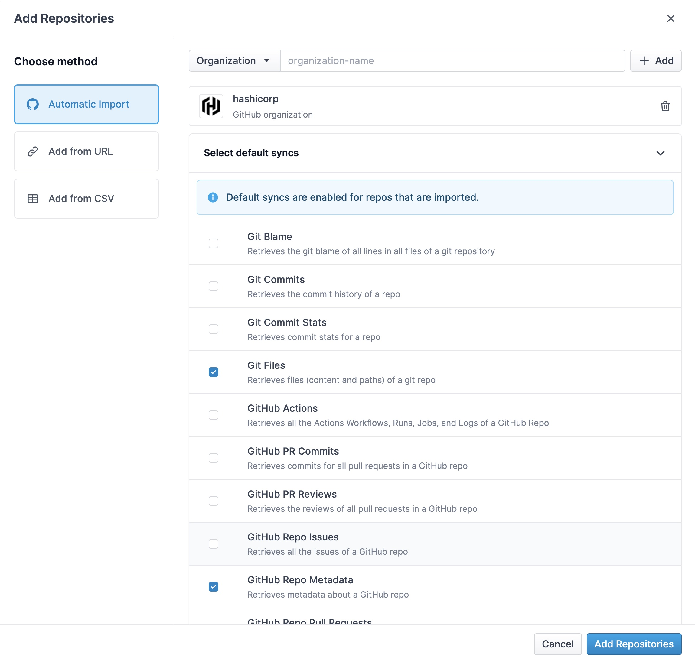
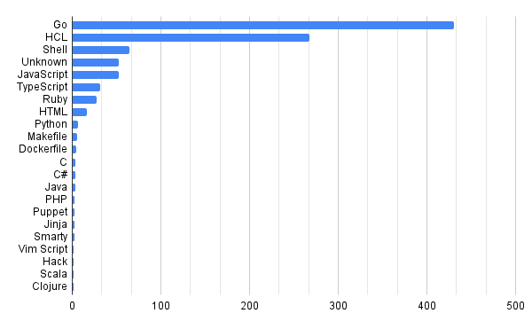
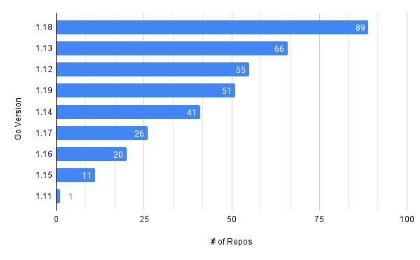

# Querying Go Mod Versions Across Many Git Repositories 📊

The GIF on our [landing page](https://www.mergestat.com/) shows a SQL query executing in a [MergeStat application](https://github.com/mergestat/mergestat):

[](https://www.mergestat.com/)

If you look closely, you'll notice that the query has something to do with `go.mod` files.
In particular, it's this query:

```sql
-- Go version counts across all repos
SELECT
    SUBSTRING(git_files.contents FROM 'go ([0-9]+.[0-9]+)') AS dependencies_go_version,
    COUNT(1) AS version_count
FROM git_files
INNER JOIN repos ON repos.id = git_files.repo_id
WHERE git_files.path LIKE '%go.mod' AND SUBSTRING(git_files.contents FROM 'go ([0-9]+.[0-9]+)') IS NOT NULL
GROUP BY dependencies_go_version
ORDER BY version_count DESC
```

which parses out the [`go` directive](https://go.dev/ref/mod#go-mod-file-go) in any `go.mod` file it finds, looking for the declared Go version.

> A go directive indicates that a module was written assuming the semantics of a given version of Go. The version must be a valid Go release version: a positive integer followed by a dot and a non-negative integer (for example, 1.9, 1.14).

## Why?

Cool - but how is this useful?
The value we are trying to convey in this query is [MergeStat's](https://github.com/mergestat/mergestat) ability to surface data across many Git repositories.
This in particular should resonate with anyone who's worked on a team responsible for lots of codebases across an organization: DevEx, DevSecOps, Platform, etc.

Aggregating Go versions across many repos is useful in ensuring a consistent experience for Go developers.
This may be important for an internal DevEx or Platform team to understand, or for any one responsible for the maintenance of many open-source, public Go projects.

It could serve as a proxy measure for how "up to date" codebases are, whether they are able to support the latest features of the language.
For instance, Generics were [introduced in `1.18`](https://go.dev/blog/go1.18), and it may be important to know how much of your Go source code is able to make use of them by looking at `go.mod` files.

## Looking at Public HashiCorp `go.mod` Files

Let's take a look at the `go.mod` files in some public Git repos.
HashiCorp is [famously](https://medium.com/hashicorp-engineering/whats-with-all-the-go-ca72c6d47e26) a large Go shop, and many of their core projects are in Go - so let's take a look at all their public repos!

Here's how I used MergeStat to do so:

### Run MergeStat

First, I grabbed a server from our friends at [Equinix Metal](https://deploy.equinix.com/metal/).
I intend to use the MergeStat `docker-compose` set-up, outlined [here](/mergestat/getting-started/running-locally/).

I `ssh` into my new server and run the following:

```sh
git clone https://github.com/mergestat/mergestat
cd mergestat
docker-compose up
```

This brings up an instance of MergeStat on port `:3300` on the IP of my new server, where I can login with the default credentials `postgres` and `password`.

### Setup Repos & Syncs

Next, I add a [GitHub PAT](https://docs.mergestat.com/mergestat/setup/github-authentication) so that I can:

1. Add a repo auto import for the [`hashicorp`](https://github.com/hashicorp) GitHub organization
2. Use the `GITHUB_REPO_METADATA` sync type (the `GIT_FILES` sync does not require GitHub authentication, since it uses the native Git protocol)



I make sure to enable the `GitHub Repo Metadata` and `Git Files` sync types.


Now, the file contents and metadata from the GitHub API should begin syncing for all public HashiCorp repos 🎉.
I can run this query to keep track of the initial sync:

```sql
SELECT count(*) FROM mergestat.repo_syncs WHERE last_completed_repo_sync_queue_id IS NULL
```

Once the result is `0`, I'll know that the first run for all the syncs I've defined are complete.

### Executing Queries

Once the initial data sync is complete, I can start executing some queries.
Let's start by identifying how many of the **977** repos are identified as Go repos ([by GitHub](https://github.com/github/linguist)):

```sql
SELECT count(*), primary_language FROM github_repo_info
GROUP BY primary_language
ORDER BY count(*) DESC
```



Looks like **431** are picked up as Go codebases.

Next, let's run the original query from above, but with a small amendment.
I'll change the `LIKE '%go.mod'` to `LIKE 'go.mod'`, to only identify `go.mod` files in the *root* of a repo.
This avoids picking up vendored Go modules.



And there you have it!
Looks like most public HashiCorp repos are on `1.18`.

You may notice that the *sum* of all repos in this query is **390**, not **431**.
This is likely because not all Go repos have a `go.mod` file.

### Operationalize It

Because MergeStat [makes use of PostgreSQL](/blog/2022/10/14/mergestat-now-with-postgres), queries like this can be hooked up to BI tools and internal dashboards.
This could be a useful way to track a migration effort, for instance, or alert on when a repo begins using a "non-standard" version of Go for your organization.

Further, these queries data can be augmented with commit and team data, to add additional dimensions.

:::info Join our Slack

Our [**community Slack**](https://join.slack.com/t/mergestatcommunity/shared_invite/zt-xvvtvcz9-w3JJVIdhLgEWrVrKKNXOYg) is a great place to find help and ask questions. We're always happy to chat about **MergeStat** there 🎉!

:::
