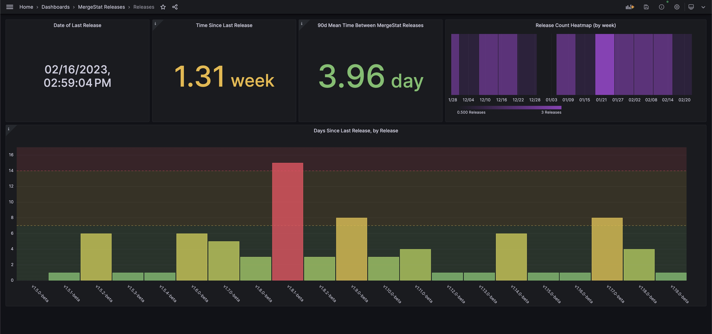

# Open-Source Git Release Tracking w/ SQL 🚀

In software, as maybe in life, *change* is as inevitable as death and taxes 🙂.
SCM/VCS tools like Git, which manage code changes, are fundamental to anyone developing code.
If [DORA](https://docs.gitlab.com/ee/user/analytics/dora_metrics.html) is your thing, you'll also know that "deployment frequency" is a key metric (as a proxy for tracking measuring development velocity over time).

In our work on [MergeStat](https://github.com/mergestat/mergestat), we've often wanted to understand **how frequently we ship code**.
In particular, we want to ensure that our work makes it's way into the hands of our users on a regular basis.
Luckily, we've been able to *use* MergeStat to keep tabs on our release frequency.
We've built an internal dashboard using [Grafana](https://grafana.com/) to support our activities around managing our releases:

[](grafana-release-dashboard.jpg)

[This dashboard](https://gist.github.com/patrickdevivo/8bbe1d8956853329bbc5c7175ede8950), and the queries powering it, allow us to answer some questions quickly:

- How long has it been since our last release?
- On average, how frequently do we typically release new versions? (Over the past 90 days)
- How are we doing relative to our own benchmarks of a "healthy" release cadence?
  - Where time-between-releases **under 1 week** is healthy ✅
  - Between **1 and 2 weeks** is a warning ❗
  - More than **2 weeks** is an alert 🚨

And here are some of the SQL queries powering these views:

```sql
-- retrieve the days since the last MergeStat release
SELECT name, committer_when, ROUND(EXTRACT(EPOCH FROM now() - committer_when)/(86400), 2) AS days_since_last_release
FROM git_tags
JOIN repos ON git_tags.repo_id = repos.id
JOIN git_commits ON git_tags.tag_commit_hash = git_commits.hash
WHERE repo = 'https://github.com/mergestat/mergestat'
ORDER BY committer_when DESC LIMIT 1
```

```sql
-- retrieve the avg (mean) time between new releases, over the last 90 days
WITH tags AS (
    SELECT
        name, committer_when,
        committer_when - LAG(committer_when) OVER (ORDER BY committer_when) AS since_prev_tag
    FROM git_tags
    JOIN repos ON git_tags.repo_id = repos.id
    JOIN git_commits ON git_tags.tag_commit_hash = git_commits.hash
    WHERE repo = 'https://github.com/mergestat/mergestat'
    AND author_when > now() - '90 days'::interval
    ORDER BY committer_when ASC
)
SELECT ROUND(EXTRACT(EPOCH FROM avg(since_prev_tag))/(86400), 2) AS mean_time_between_releases FROM tags
```

**What comes next?**

- We'd like to *alert* to our Slack when it's been too long since a release
- We'd like a regular push to our Slack for a regular update on how our release cadence is
- 

:::info Join our Slack

If this you found this interesting or would like a similar view of your release cadence, hop in our [**community Slack**](https://join.slack.com/t/mergestatcommunity/shared_invite/zt-xvvtvcz9-w3JJVIdhLgEWrVrKKNXOYg)! We're always happy to chat about **MergeStat** there 🎉.

:::