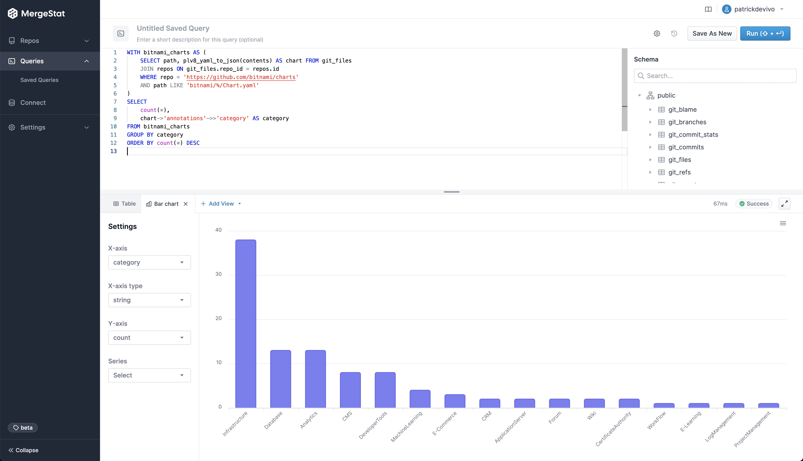

# Querying YAML in PostgreSQL with PLV8 🐘

[MergeStat](https://www.mergestat.com/)'s mission is to make it possible to query *anything* involved in building & shipping software with SQL.
Recently, we had a user looking to query YAML files across their git repos, wanting to extract and aggregate values from config files.

We thought for a bit, and came up with a solution.
An odd one, but one that works surprisingly well 😃.

## How it works

1. Ensure the [`PLV8` extension](https://plv8.github.io/) is installed in Postgres. This allows us to run JavaScript *in* the database.
2. Create a user-defined function `plv8_yaml_to_json()` that uses an [existing JavaScript YAML parser](https://github.com/nodeca/js-yaml), to convert YAML strings into JSON.
3. Write and execute SQL that uses the new function and the native [Postgres JSON operators](https://www.postgresql.org/docs/current/functions-json.html) to query what you're looking for 🎉.

**Here it is altogether!**

import Gist from 'react-gist'

<Gist id='668f512c96c7f755532370e146acd6ed' />

## What can we query?

Well, to showcase this, let's look at a git repo with a lot of YAML.
One good example is the public [`bitnami/charts`](https://github.com/bitnami/charts) repo, which is a collection of [Helm Charts](https://github.com/helm/helm) for popular OSS applications to run on Kubernetes.


### List all Helm charts (and their annotated category)
```sql
WITH bitnami_charts AS (
    SELECT path, plv8_yaml_to_json(contents) AS chart FROM git_files
    JOIN repos ON git_files.repo_id = repos.id
    WHERE repo = 'https://github.com/bitnami/charts'
    AND path LIKE 'bitnami/%/Chart.yaml'
)
SELECT
    chart->>'name' AS chart_name,
    chart->>'description' AS chart_description,
    chart->'annotations'->>'category' AS category
FROM bitnami_charts
```

|chart_name    |chart_description                                                                                                                                                                                      |category      |
|--------------|-------------------------------------------------------------------------------------------------------------------------------------------------------------------------------------------------------|--------------|
|airflow       |Apache Airflow is a tool to express and execute workflows as directed acyclic graphs (DAGs). It includes utilities to schedule tasks, monitor task progress and handle task dependencies.              |WorkFlow      |
|apache        |Apache HTTP Server is an open-source HTTP server. The goal of this project is to provide a secure, efficient and extensible server that provides HTTP services in sync with the current HTTP standards.|Infrastructure|
|appsmith      |Appsmith is an open source platform for building and maintaining internal tools, such as custom dashboards, admin panels or CRUD apps.                                                                 |CMS           |
|argo-cd       |Argo CD is a continuous delivery tool for Kubernetes based on GitOps.                                                                                                                                  |Infrastructure|
|argo-workflows|Argo Workflows is meant to orchestrate Kubernetes jobs in parallel. It uses DAG and step-based workflows                                                                                               |Infrastructure|
|**...**|

### How many charts are in each category?

```sql
WITH bitnami_charts AS (
    SELECT path, plv8_yaml_to_json(contents) AS chart FROM git_files
    JOIN repos ON git_files.repo_id = repos.id
    WHERE repo = 'https://github.com/bitnami/charts'
    AND path LIKE 'bitnami/%/Chart.yaml'
)
SELECT
    count(*),
    chart->'annotations'->>'category' AS category
FROM bitnami_charts
GROUP BY category
ORDER BY count(*) DESC
```

[](bitnami-chart-categories.jpg)

Hopefully that gives you a sense of what's possible chaining together YAML, [MergeStat](https://github.com/mergestat/mergestat), JavaScript, and Postgres!

:::info Join our Slack

If this you found this interesting, hop in our [**community Slack**](https://join.slack.com/t/mergestatcommunity/shared_invite/zt-xvvtvcz9-w3JJVIdhLgEWrVrKKNXOYg)! We're always happy to chat about **MergeStat** there 🎉.

:::
