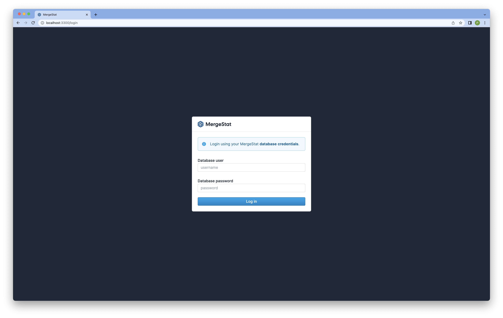
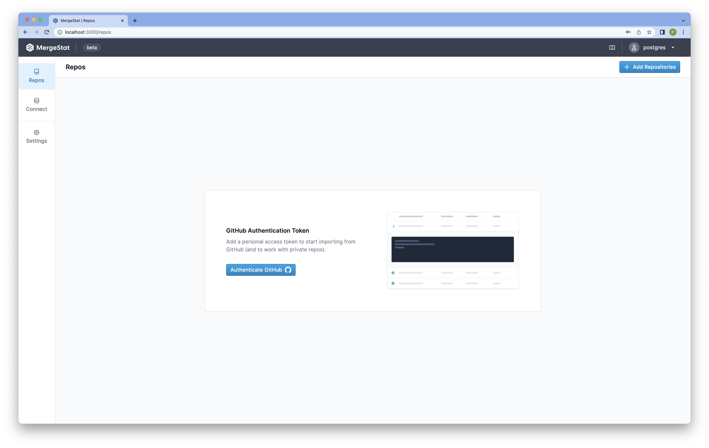

# Running Locally

Start by cloning the [`mergestat/mergestat`](https://github.com/mergestat/mergestat/) repository to a local directory.
`cd` into the root of the repository and run:

```
docker-compose up
```

That should be sufficient to bring up a local instance of MergeStat 🎉.
To access the management console, visit [`http://localhost:3300/`](http://localhost:3300/), and you should see a login screen:



In order to login, you will need to authenticate with a *database user*.
By default, use **`postgres`** as the username and **`password`** as the password (this is configured in the `docker-compose.yaml` file).
Now you can begin adding Git repositories 🎉.



:::tip

If you want to use MergeStat on *private* GitHub repos, automatically sync repos from a GitHub org, or use any GitHub API sync types, you will need to add a GitHub [**personal access token**](https://docs.github.com/en/authentication/keeping-your-account-and-data-secure/creating-a-personal-access-token) in the settings area ([`https://localhost:3300/settings`](https://localhost:3300/settings)).

:::
